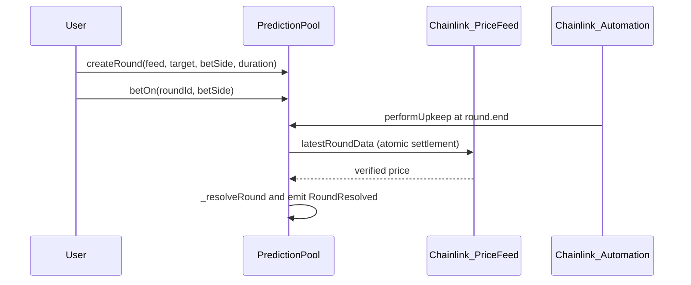
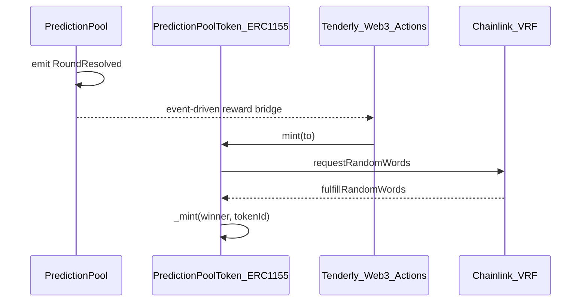

[](https://bet2gether-alpha.vercel.app)

[](LICENSE)

# 🎲 Bet2Gether: Autonomous Chainlink Oracle-Driven Settlement Protocol

Bet2Gether is an asynchronous market protocol for trust-minimized prediction settlement. It uses **Chainlink Automation**, **Chainlink Price Feeds**, and **Chainlink VRF v2.5** (ERC-1155 rewards via [`PredictionPoolToken`](be/src/PredictionPoolToken.sol)) so settlement and reward draws do not rely on centralized administrative control.

## Architectural design

The protocol is an on-chain state machine: resolution does not depend on ad hoc user or admin decisions.

- **Deterministic resolution:** Settlement uses `AggregatorV3Interface` inside `_resolveRound` after the round deadline so payout logic is tied to oracle output at resolution time ([`PredictionPool`](be/src/PredictionPool.sol)).
- **Autonomous execution:** [`PredictionPool`](be/src/PredictionPool.sol) implements **`AutomationCompatibleInterface`**. Automation calls `performUpkeep`; eligible rounds transition state and emit `PredictionPool_RoundResolved`.
- **Verifiable scarcity:** [`PredictionPoolToken`](be/src/PredictionPoolToken.sol) uses **Chainlink VRF v2.5** (`VRFConsumerBaseV2Plus`) so ERC-1155 `tokenId` assignment is not predictable from on-chain metadata alone and is verified by the VRF coordinator.

## Technical specification

| Pattern | Rationale |
|---------|-----------|
| **Checks-Effects-Interactions (CEI)** | In `claimReward`, internal state (e.g. `claimed`) is updated before the external ETH transfer ([`PredictionPool`](be/src/PredictionPool.sol)). |
| **Atomic payouts** | `_resolveRound` reads the settlement price and updates round status in one execution step for that round. |
| **Non-deterministic rewards** | In `fulfillRandomWords`, `tokenId = randomWord % I_MAX_TOKEN_ID` ([`PredictionPoolToken`](be/src/PredictionPoolToken.sol)). |
| **Reentrancy guard** | `nonReentrant` on `claimReward` only ([`PredictionPool`](be/src/PredictionPool.sol)). |

### Test metrics (Foundry)

Branch coverage indicates how much of the contracts’ conditional branching was executed under tests—not total logical completeness.

| Contract | Lines | Branches | Functions |
|----------|-------|----------|-----------|
| PredictionPool | 89.53% | 77.78% | 96.00% |
| PredictionPoolToken | 85.71% | 25.00% | 87.50% |

```bash
cd be && forge install
cd be && forge test --gas-report
cd be && forge coverage
```

## Logic and orchestration

### 1. Market lifecycle (autonomous resolution)

Rounds move from **Active** toward **Resolved** via Automation. `_resolveRound` reads the feed for settlement.



### 2. Event-driven reward bridge

A **Tenderly Web3 Action** listens for `PredictionPool_RoundResolved`. When the configured logic applies (e.g. round creator is a winner), it calls `PredictionPoolToken.mint(to)`. VRF fulfillment performs `_mint`.



## System stack

### Protocol layer

| Component | Technology |
|-----------|------------|
| Execution | Solidity ^0.8.13, Foundry (build, test, script), OpenZeppelin |
| Middleware | Chainlink VRF v2.5, Automation, Price Feeds |
| Orchestration | Tenderly Web3 Actions, Alchemy WebSockets |

### Application layer ([`fe/package.json`](fe/package.json))

| Component | Technology |
|-----------|------------|
| Framework | Next.js 16 (App Router), React 19, TypeScript |
| State and cache | TanStack Query v5, React Context (rounds/bets) |
| Web3 | wagmi v2, viem, RainbowKit |
| UI | Tailwind CSS 4, Radix UI (`components/ui`), TanStack Table, React Hook Form + Zod |

## Deployment and verification

### Sepolia (verified deployments)

| Contract | Address |
|----------|---------|
| PredictionPool | `0x51A0a7561dEbA056C1cDF5aB4c369Db686c77EF6` |
| PredictionPoolToken | `0xddd3c73caE8541FC6Ea119C1BffC5B6547D33eCf` |

Etherscan: [PredictionPool](https://sepolia.etherscan.io/address/0x51A0a7561dEbA056C1cDF5aB4c369Db686c77EF6), [PredictionPoolToken](https://sepolia.etherscan.io/address/0xddd3c73caE8541FC6Ea119C1BffC5B6547D33eCf).

### Contracts

Set `ALCHEMY_SEPOLIA_RPC_URL`, `PRIVATE_KEY`, and `ETHERSCAN_API_KEY` in `be/.env`. Constants: [`be/script/Constants_PredictionPool.sol`](be/script/Constants_PredictionPool.sol), [`be/script/Constants_PredictionPoolToken.sol`](be/script/Constants_PredictionPoolToken.sol).

```bash
cd be
forge script script/PredictionPoolScript.s.sol \
  --rpc-url $ALCHEMY_SEPOLIA_RPC_URL --broadcast --verify
forge script script/PredictionPoolTokenScript.s.sol \
  --rpc-url $ALCHEMY_SEPOLIA_RPC_URL --broadcast --verify
```

### Frontend

```bash
cd fe && pnpm install && pnpm dev
```

After deployment, sync [`fe/app/_contracts/`](fe/app/_contracts/) with ABIs and addresses.

`fe/.env`: `NEXT_PUBLIC_ETH_SEPOLIA_ALCHEMY_HTTP_URL`, `NEXT_PUBLIC_ETH_SEPOLIA_ALCHEMY_WS_URL`, `NEXT_PUBLIC_WALLETCONNECT_PROJECT_ID`.

### Tenderly

Configure [`web3-actions/`](web3-actions/) with ABIs and addresses, then:

```bash
cd web3-actions && tenderly actions deploy
```

## Future roadmap

- **L2 convergence:** Deploy to Arbitrum or Optimism (or similar) to compare settlement and UX cost vs Sepolia/L1-style usage.
- **On-chain convergence:** Replace Tenderly-triggered minting with logic in core contracts for a fully on-chain reward path.
- **ZKP research:** Assess zero-knowledge proofs for privacy-preserving reward claims.

## Author

**Siegfried Bozza** · M.Sc / M.Eng · Full-stack & Web3 builder.

Bet2Gether was built solo, alongside a full-time full-stack job (contracts, frontend, deployment, infrastructure).

- [LinkedIn](https://www.linkedin.com/in/siegfriedbozza/)
- [GitHub](https://github.com/SiegfriedBz)
