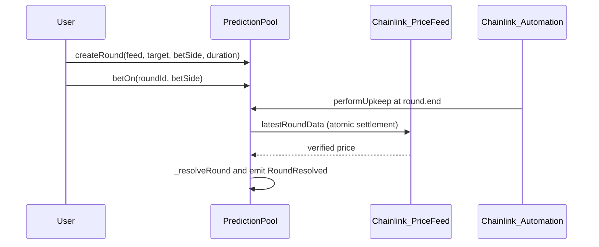
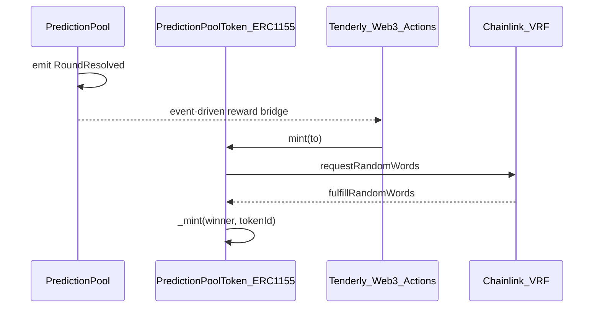

[](https://bet2gether-alpha.vercel.app)


[](LICENSE)

# Bet2Gether — Autonomous Oracle-Driven Prediction Markets

A trust-minimized prediction protocol on **Ethereum Sepolia** where players bet ETH on whether a Chainlink price feed will close above or below a target by a deadline. Settlement is triggered by **Chainlink Automation**, the winning side splits a **time-weighted pool** (earlier bets carry more weight), and round creators that win are rewarded with a **Chainlink VRF**–randomized ERC-1155 collectible via a **Tenderly Web3 Action** bridge.

---

## Quick Start

1. Open the **[live demo](https://bet2gether-alpha.vercel.app)**.
2. Connect a wallet on **Ethereum Sepolia**.
3. **Create a round** (pick a Chainlink feed, target price, side, duration) or **bet on an active round**.
4. After the deadline, Chainlink Automation resolves the round; winners pull their share with **Claim Rewards**.

Need testnet ETH? [Sepolia Faucet](https://sepolia-faucet.pk910.de/)


---

## The Problem

Prediction markets only work if settlement is credibly neutral. Two common designs both fail that bar:

- **Operator-settled markets** — an admin or off-chain keeper picks the price, calls `resolve()`, and decides who gets paid. The platform's value proposition (trust-minimized outcomes) collapses into trusting one entity.
- **Permissionless on-chain markets without a keeper** — somebody still has to trigger resolution. If users do it, settlement is gameable (winners delay, losers grief). If a single bot does it, you are back to operator risk.

Reward distribution layers add a second trust hole: random rewards driven by `block.hash`, `block.timestamp`, or admin-picked `tokenId`s are predictable or manipulable, especially by miners/validators or the operator themselves.

## The Solution

Bet2Gether removes administrative discretion from both settlement and reward draws. The protocol is an on-chain state machine: nothing about the outcome depends on a human decision after a round opens.

- **Deterministic resolution.** [`PredictionPool._resolveRound`](be/src/PredictionPool.sol) reads `AggregatorV3Interface.latestRoundData()` for the round's allow-listed feed and compares it to `round.target`. Decimals are normalized to 1e18 and negative answers revert.
- **Autonomous execution.** [`PredictionPool`](be/src/PredictionPool.sol) implements `AutomationCompatibleInterface`. `checkUpkeep` returns the IDs of rounds whose deadline has passed; `performUpkeep` resolves them and emits `PredictionPool_RoundResolved`. No user has to call `resolve()`.
- **Time-weighted payouts.** [`getBetWeight`](be/src/PredictionPool.sol) scales each bet by `((round.end - bet.time) * 1e18) / (round.end - round.start)`, so earlier conviction earns a larger share of the pool than late-round piling-on.
- **Pull payments with CEI + reentrancy guard.** `claimReward` marks `bet.claimed = true` and emits before the external ETH transfer, and is protected by OpenZeppelin's `nonReentrant`.
- **Verifiable scarcity.** [`PredictionPoolToken`](be/src/PredictionPoolToken.sol) is an ERC-1155 minted only via `VRFConsumerBaseV2Plus`. The winning `tokenId = randomWord % I_MAX_TOKEN_ID` is computed inside `fulfillRandomWords`, so the asset assigned to a winner cannot be predicted from on-chain state alone.
- **Event-driven reward bridge.** A Tenderly Web3 Action ([`web3-actions/actions/predictionPoolActions.ts`](web3-actions/actions/predictionPoolActions.ts)) listens for `PredictionPool_RoundResolved` and, when `creatorIsWinner == true`, calls `PredictionPoolToken.mint(creator)` — gated by the `MINTER_ROLE` so arbitrary callers cannot mint.

---

## Features in Action

### Create a round and bet

The round creator picks a Chainlink feed, target price, side, and duration. Their bet is the first one in.


A second player joins on the opposite side. Time-weighted bookkeeping is updated on each bet.


### Autonomous resolution by Chainlink Automation

When the deadline hits, `checkUpkeep` flags the round and Chainlink Automation calls `performUpkeep`. The contract reads the price feed, picks the winning side, and emits `PredictionPool_RoundResolved`.


### Reward bridge: Tenderly + Chainlink VRF

If the round creator was on the winning side, the Tenderly Web3 Action mints an ERC-1155 collectible to them. VRF picks the `tokenId` so the asset is non-deterministic.


Tenderly execution log confirming the off-chain bridge fired:


### Pull-payment claim

Winners claim their share of the pool from the Claim Rewards tab. Payouts are proportional to `playerWeight / totalWeight`.


---

## Architecture

Two contracts on Sepolia, one off-chain Tenderly Action acting as a bridge, and a Next.js client that talks to all of it through wagmi/viem.


| Pattern | Rationale |
|---------|-----------|
| **Checks-Effects-Interactions (CEI)** | In `claimReward`, internal state (e.g. `claimed`) is updated before the external ETH transfer ([`PredictionPool`](be/src/PredictionPool.sol)). |
| **Atomic payouts** | `_resolveRound` reads the settlement price and updates round status in one execution step for that round. |
| **Non-deterministic rewards** | In `fulfillRandomWords`, `tokenId = randomWord % I_MAX_TOKEN_ID` ([`PredictionPoolToken`](be/src/PredictionPoolToken.sol)). |
| **Reentrancy guard** | `nonReentrant` on `claimReward` only ([`PredictionPool`](be/src/PredictionPool.sol)). |

### 1. Market lifecycle (autonomous resolution)

Rounds move from **Active** toward **Resolved** via Automation. `_resolveRound` reads the feed for settlement.



### 2. Event-driven reward bridge

A **Tenderly Web3 Action** listens for `PredictionPool_RoundResolved`. When the configured logic applies (e.g. round creator is a winner), it calls `PredictionPoolToken.mint(to)`. VRF fulfillment performs `_mint`.



---

## Tech Stack

| Layer | Technologies |
|-------|--------------|
| Smart contracts | Solidity ^0.8.13, Foundry (build, test, script), OpenZeppelin (Ownable, AccessControl, ReentrancyGuard, ERC1155) |
| Oracle middleware | Chainlink Automation, Chainlink Price Feeds, Chainlink VRF v2.5 |
| Off-chain orchestration | Tenderly Web3 Actions, Alchemy RPC + WebSockets |
| Frontend | Next.js 16 (App Router), React 19, TypeScript, Tailwind CSS 4, Radix UI, shadcn/ui |
| Web3 client | wagmi v2, viem, RainbowKit |
| State and tables | TanStack Query v5, TanStack Table, React Context (rounds/bets) |
| Forms | React Hook Form + Zod |
| Quality | Foundry tests + coverage, ESLint, GitHub Actions CI ([`.github/workflows/foundry-tests.yml`](.github/workflows/foundry-tests.yml)) |

---

## Test Metrics

Branch coverage indicates how much of the contracts' conditional branching was executed under tests — not total logical completeness. CI runs `forge test -vvv` on every push and PR to `main`/`develop` ([`.github/workflows/foundry-tests.yml`](.github/workflows/foundry-tests.yml)).

| Contract | Lines | Branches | Functions |
|----------|-------|----------|-----------|
| PredictionPool | 89.53% | 77.78% | 96.00% |
| PredictionPoolToken | 85.71% | 25.00% | 87.50% |

```bash
cd be && forge install
cd be && forge test --gas-report
cd be && forge coverage
```

---

## Setup (Deployment and Verification)

### Deployed addresses (Sepolia)

| Contract | Address |
|----------|---------|
| PredictionPool | `0x51A0a7561dEbA056C1cDF5aB4c369Db686c77EF6` |
| PredictionPoolToken | `0xddd3c73caE8541FC6Ea119C1BffC5B6547D33eCf` |

Etherscan: [PredictionPool](https://sepolia.etherscan.io/address/0x51A0a7561dEbA056C1cDF5aB4c369Db686c77EF6) · [PredictionPoolToken](https://sepolia.etherscan.io/address/0xddd3c73caE8541FC6Ea119C1BffC5B6547D33eCf).

### Contracts

Set `ALCHEMY_SEPOLIA_RPC_URL`, `PRIVATE_KEY`, and `ETHERSCAN_API_KEY` in `be/.env`. Allow-listed feeds and VRF parameters live in [`be/script/Constants_PredictionPool.sol`](be/script/Constants_PredictionPool.sol) and [`be/script/Constants_PredictionPoolToken.sol`](be/script/Constants_PredictionPoolToken.sol).

```bash
cd be
forge script script/PredictionPoolScript.s.sol \
  --rpc-url $ALCHEMY_SEPOLIA_RPC_URL --broadcast --verify
forge script script/PredictionPoolTokenScript.s.sol \
  --rpc-url $ALCHEMY_SEPOLIA_RPC_URL --broadcast --verify
```

After deployment, fund the Chainlink Automation upkeep registered for `PredictionPool` and the VRF subscription configured for `PredictionPoolToken`.

### Frontend

```bash
cd fe && pnpm install && pnpm dev
```

`fe/.env` requires `NEXT_PUBLIC_ETH_SEPOLIA_ALCHEMY_HTTP_URL`, `NEXT_PUBLIC_ETH_SEPOLIA_ALCHEMY_WS_URL`, and `NEXT_PUBLIC_WALLETCONNECT_PROJECT_ID`. Network config: [`fe/app/_config/wagmi.ts`](fe/app/_config/wagmi.ts).

After deploying the contracts, sync ABIs and addresses in [`fe/app/_contracts/`](fe/app/_contracts/).

### Tenderly Web3 Action

The action source is [`web3-actions/actions/predictionPoolActions.ts`](web3-actions/actions/predictionPoolActions.ts) and the trigger spec is [`web3-actions/tenderly.yaml`](web3-actions/tenderly.yaml). Configure the Tenderly project secrets `PRIVATE_KEY` (the address holding `MINTER_ROLE` on `PredictionPoolToken`) and `RPC_URL_KEY`, then deploy:

```bash
cd web3-actions && tenderly actions deploy
```

---

## Future Roadmap

- **L2 convergence.** Deploy to Arbitrum or Optimism (or similar) to compare settlement and UX cost vs Sepolia/L1-style usage.
- **On-chain convergence.** Replace the Tenderly-triggered minting with logic in core contracts for a fully on-chain reward path.
- **ZKP research.** Assess zero-knowledge proofs for privacy-preserving reward claims.

---

## Author

**Siegfried Bozza** · M.Sc / M.Eng · Full-stack Web3 engineer.

Bet2Gether was built solo, alongside a full-time full-stack job (contracts, frontend, deployment, infrastructure).

- [LinkedIn](https://www.linkedin.com/in/siegfriedbozza/)
- [GitHub](https://github.com/SiegfriedBz)
